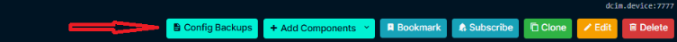
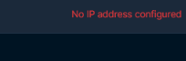
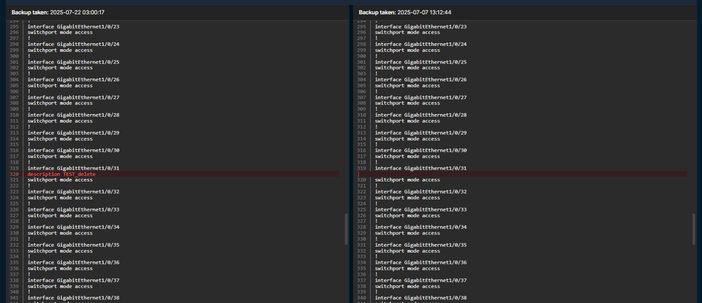

# Config Backup

Тут в целом всё просто.\
Непонятно только зачем это делать в NB - нормального ответа у меня нет.

## Что делает?

Данный плагин предназначен для автоматического сбора текущей конфигурации с сетевого оборудования (в будущем возможен сбор инфы и с серверов (наверное)).\
Cетевое оборудование: Huawei, Mellanox, Cisco-like devices (B4COM, Qtech, Aquarius, Cisco, maybe more i don't remember them all).

## Как работает?

1. Появляется новая кнопка Config Backups при просмотре конкретного девайса.\

2. При нажатии открывается окно с плагином для данного девайса.\
**Собирать текущий конфиг с устройства возможно, только если назначен Management Out-of-band IP или Primary IPv4 адрес !!!**\
Пример, если IP адрес не назначен:\
\
Пример при назначенном IP адресе:\

3. Далее интуитивно всё понятно.\
Можем включить Collect Auto (сбор каждые 12 часов c помощью management/commands+cron), либо собрать прямо сейчас.\
При этом, если включен Auto, то новый лог сохраняется, только если он отличается от предыдущего.\
Также есть ограничение в кол-во сохраняемых логов - не помню сколько, но это легко правится.
4. Eсть возможность сравнить два конфига.\
Выделяем два конфига и нажимаем на Compare Selected (старался сделать по аналогии с Notepad++, получилось как Notepad+-):\

5. Eсть возможность просто посмотреть один конфиг с кнопкой copy.

Чтобы заработало создать файл /opt/netbox/netbox/netbox_config_backup.env (можно и в другом месте сохранить),\
где будет логпасс учетки с доступом до коммутатора. ([collect_scheduled_backups.py](management%2Fcommands%2Fcollect_scheduled_backups.py))\
Ну про сам crontab не забыть.

Такая себя инструкция, но раз у меня получилось, то у вас тоже получится.