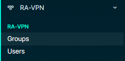
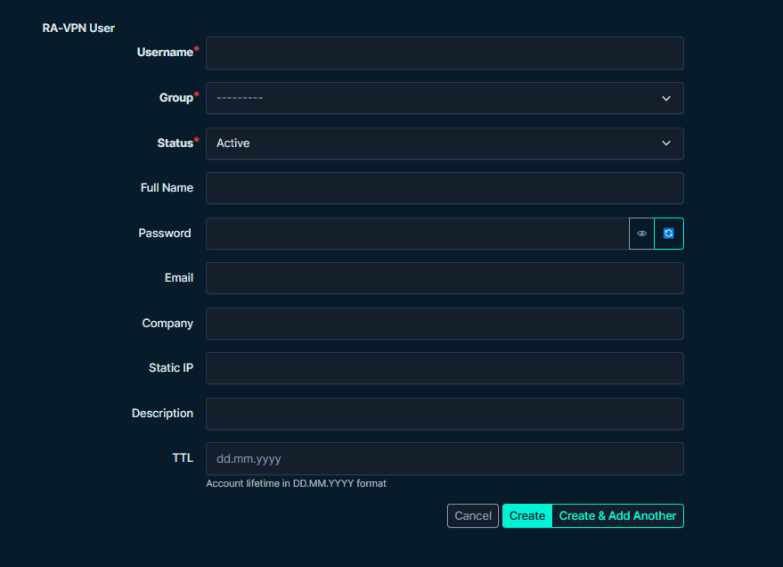
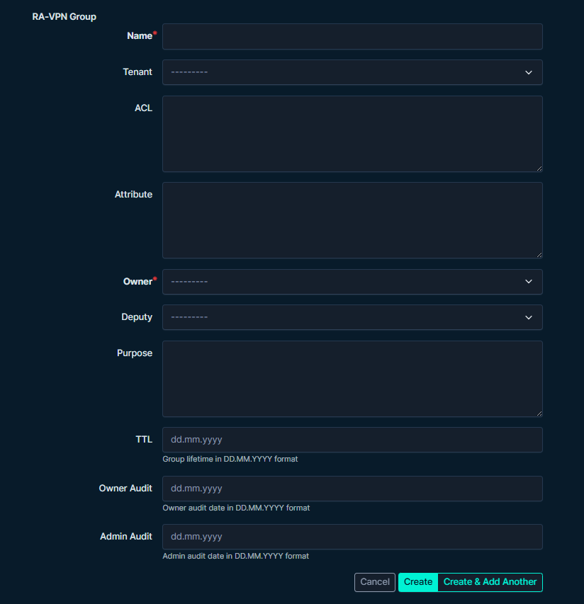

# RA VPN

Тут жесть.

## Как это вся история возникла?

Учетки для подключения к инфраструктуе создавались руками через AD.\
Потом всё это записывалось в Confluence.\
Далее напрявлялось пользователю.

Звучит не прям удобно, не так ли?

## Что придумали?

Решили вести учёт в Netbox с помощью плагина.\
Потом и вовсе обнаглели и решили: "А давайте создавать учетки через NB?"

Так вот этот плагин именно это и делает.\
Честно, я не уверен, что готов расписать тут всё, да и не думаю, что вообще кто-то этим будет пользоваться.\
Почему? да потому что как-будто бы слишком частный случай.\
Но если рискнете, то подсвечу основные моменты, которые необходимо поправить.

## Что может?

Действие в NB = действие на AD (нет интеграции с ISE - мб в будущем)\
1. Создать группу
2. Создать юзера с привязкой к группе, сгенерировать пароль, правильно назначить доступ
3. Включить/отключить УЗ
4. Изменить параметры юзера
5. Функционал по удаление решили не добавлять на всякий случай
6. Да и в целом все наверное

## На что обратить внимание?

1. models.py 
Пометил комментариями, что нужно поправить.\
Сначала файлик с УЗ, у которой есть доступ на изменение/создание юзеров на AD.\
Дальше идут функции на создание/апдейт юзера и создание группы. Это очень кастомная вещь и нужно будет править под свою инфру.
2. templates/ra_vpn/user_edit.html\
Внизу есть метод генерации пароля - если он вас не устраивает, то можно его там поменять
3. templates/ra_vpn/user.html\
Изменить текст, который будет вставляться в почту.

Как-будто бы всё, но самый гемор с powershell скриптами в models.py\
На самом деле, просто сначала понять их логику, а потом адаптировать под себя.

## Как это выглядит вообще?

Создание пользователя:\

Создание группы:\

Остальные скрины добавлю позже
